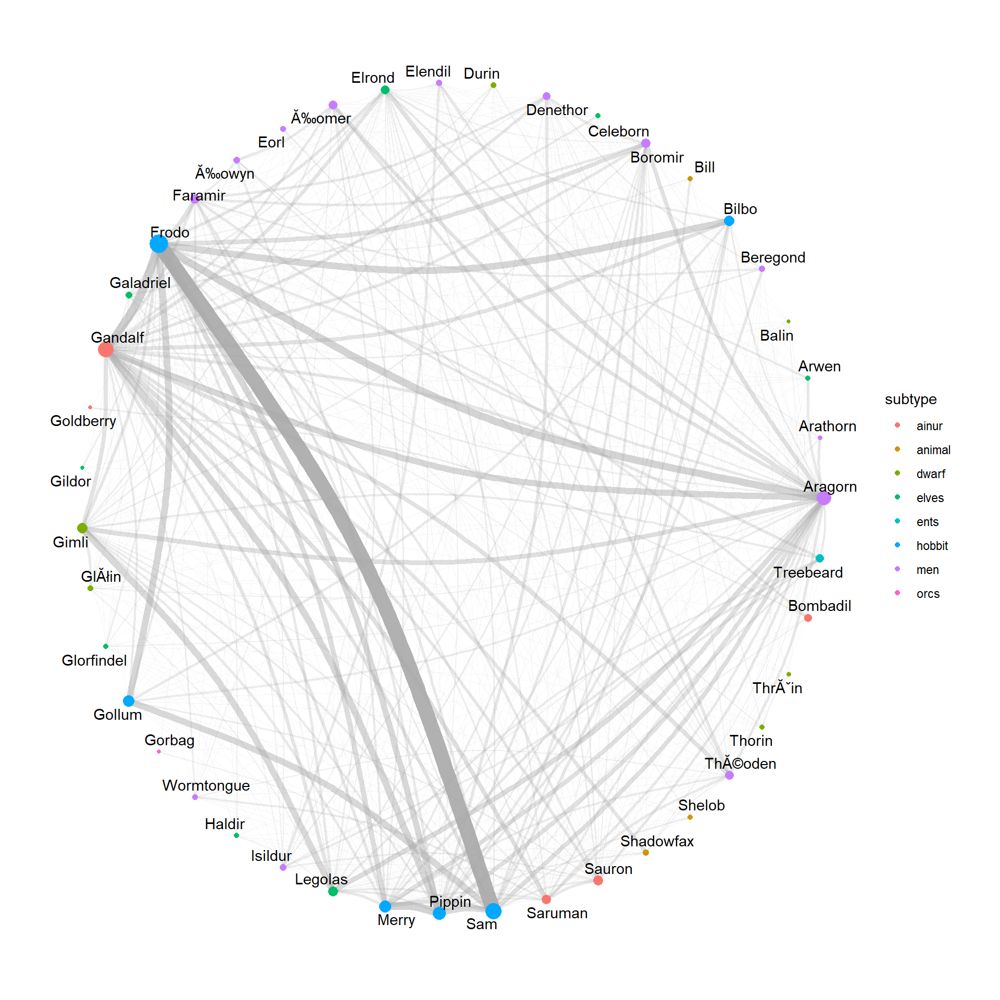
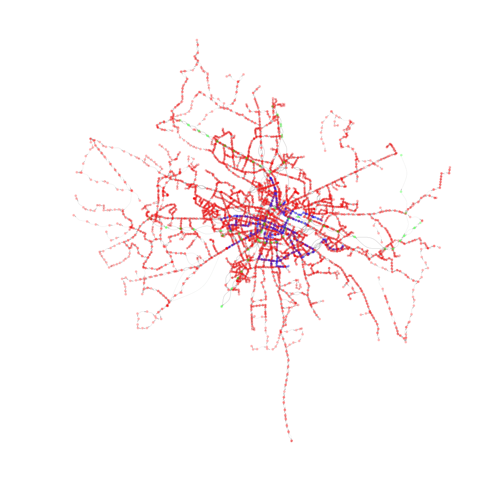
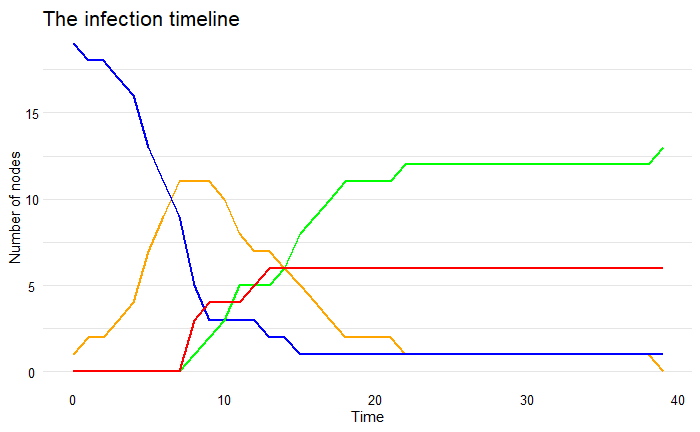

# Teoria grafów

## Definicja grafu / sieci

Grafem nazwiemy parę $V, E$ - zbiór wierzchołków $V$ (vertices/nodes) oraz krawędzi $E$ (edges). W przypadku ich tworzenia oraz wizualizacji najważniejsze są właśnie krawędzie, gdyż nawet nie mając zbioru wierzchołków jesteśmy w stanie wygenerować go na podstawie zbioru krawędzi.

Za pomocą grafów możemy reprezentować wiele zjawisk, które bazują na relacjach między poszczególnymi obiektami.

## Rodzaje grafów
1.  **Grafy proste** - krawędzie są niezorientowane, bez wag, istnieje tylko jedna warstwa, itd,
2.  **Grafy skierowane** - krawędzie mają kierunek, np. istnieje krawędź z $A$ do $B$, ale z $B$ do $A$ już nie,
3.  **Multigrafy** - dopuszczamy aby dwa wierzchołki łączyłą więcej niż jedna krawędź oraz pętle z $A$ do $A$,
4.  **Grafy ważone** - każda krawędź ma przyporządkowaną wagę, co potem wpływa na interpretację sieci,
5.  **Grafy warstwowe** - krawędzie należą do różnych warstw grafu, pomimo że zbiór wierzchołków jest stały,
6.  **Hipergrafy** - najbardziej skomplikowane struktury zezwalające na nie-binarne relacje.

W trakcie laboratorium (a także w praktyce) najczęściej spotykamy się z grafami i kombinacjami z punktów 1-4.
 
## Ważne pojęcia

1.  **Macierz sąsiedztwa** - Macierz $A$ o wymiarach $N x N$ dla grafu o $N$ wierzchołkach, gdzie $a_{ij}$ to siła krawędzi z $i$ do $j$.
 2.  **Stopień wierzchołka** - Liczba krawędzi wychodzących z wierzchołka (grafy nieskierowane). Dla skierowanych mamy stopień wierchołka wchodzący (in) oraz wychodzący (out) i nie muszą być równe.
3.  **Ścieżka w grafie** - Ścieżką między $A$ i $B$ nazwiemy zbiór krawędzi, który wspólnie łączą wierzchołki $A$ i $B$.
4.  **Dystans** - Dystansem między $A$ i $B$; $d(A,B)$ nawiemy najkrótszą ścieżkę między $A$ i $B$.
5.  **Spójność grafu** - graf jest spójny gdy z każdego wierzchołka istnieje ścieżka do każdego innego.

## Sieci rzeczywsite (real networks)

 W ramach laboratorium zajmować będziemy się jedynie sieciami rzeczywistymi, jako że są to struktury najczęściej występujące w naturze. Aby rozpoznać czy mamy do czynienia z taką siecią należy dokonać prostej analizy grafu i odpowiedzieć na następujące pytania:
   
1.  Czy rozkład stopni wierzchołków ma gruby ogon?
2.  Czy mamy do czynienia ze zjawiskiem małego świata (średnica grafu mniejsza niż 6)? (small-world phenomenon)
3.  Czy krawęzie są silnie skorelowane? (clustering coefficient)

Jeśli na część z nich odpowiemy 'Tak' oznacza to że prawdopodbnie mamy do czynienia z siecią rzeczywistą.

# Bonus

## Dialogi w książkach z Władcy Pierścieni

## Różne reprezentacje dialogów w Romeo i Julia

## Komunikacja w warszawie od 22 do 6 rano

-   Niebieski - tramwaje,

-   Czerwony - Autobusy,

-   Zielony - Pociągi.

## Analiza empidemii SIR

-   Niebieski - niezakażone jednostki,

-   Żółty - jednostki zakażone,

-   Czerwony - jednostki zmarłe,

-   Zielony - jednostki ozdrowiałe i odporne.

